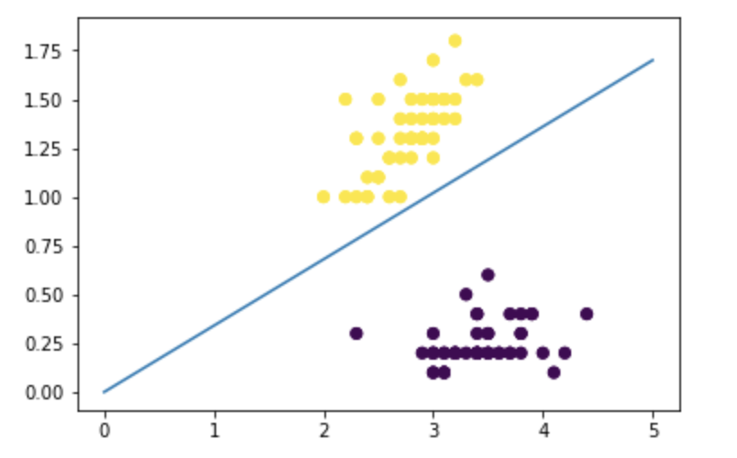
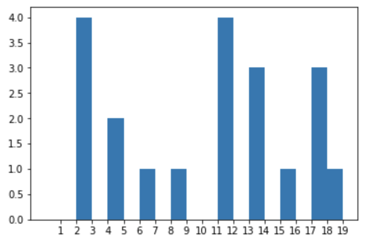
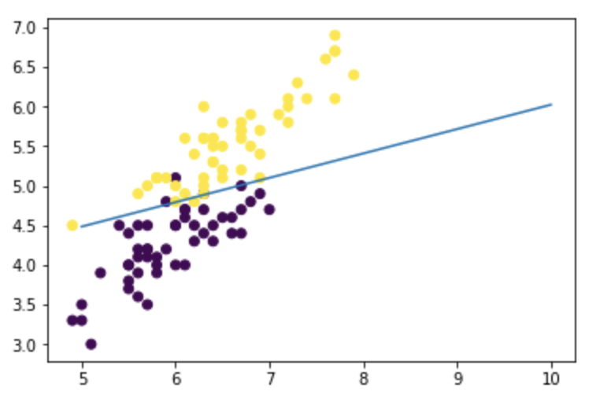

# Binary Classification with Perceptron and SVM

## Binary Perceptron：

* ```python
    # Calculate sign
    def give_sign(w,b,x):
        result = np.dot(w,x)+b
        if result >0:
            return 1
        else:
            return -1

    # Perceptron Function        
    def pc(x, y):
        # randomly gives an order for the indexing
        indices = random.sample(range(0,y.shape[0]), y.shape[0])
        
        # intialize w and b
        # initialize w base on the column number of x
        w = np.zeros(x.shape[1])
        b = 0
        
        for i in indices:
            data_x = x[i]
            data_y = y[i]
            result = give_sign(w,b,data_x)
            if data_y*result < 0:
                w = w+ data_y*data_x
                b = b + data_y
        return [w,b]
    ```
* <br /> <br /> 
* <br /> <br /> 

## Binary SVM：
*   ```
    C: 1.0
    0.93
    [16 15]
    C: 2.0
    0.94
    [12 12]
    C: 3.0
    0.95
    [11 11]
    C: 5.0
    0.94
    [10 11]
    C: 7.0
    0.95
    [10  9]
    C: 9.0
    0.95
    [10  9]
    C: 10.0
    0.95
    [9 9]
    C: 50.0
    0.95
    [7 7]
    C: 100.0
    0.95
    [7 7]
    C: 1000.0
    0.95
    [7 7]
    ```
* When C=11.5, it has accuracy of 0.96.
<br /> <br /> 