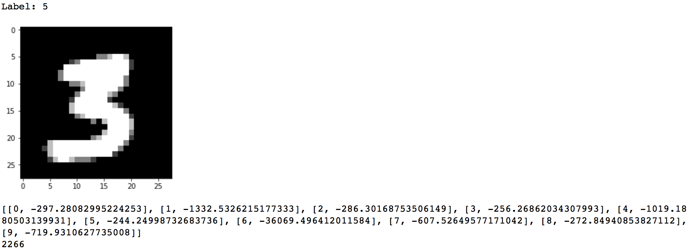

# Handwritten Digits Recognition Using Gaussian Generative Method #

## The Prediction Rule ##
 The prediction rule is basically bayes' rule. We calculate $\pi_i*p_i(x)$ for each class $i$, and then take the one with maximum value as our prediction.
 
## Core Implementation ##
```python
# Training
# read in the data
training_img = read_data(file1)
training_label = read_data(file2)
test_img = read_data(file3)
test_label = read_data(file4)

#reshape the data
training_img = reshape(training_img, [trainin])

# split the set into training and validation set
# since MNIST set are not in any order, we'll just choose the 
# last 1000 training data
valid_size=5
validation_img = training_img[: valid_size].append(training_img[-valid_size:])
validation_label = training_label[: valid_size].append(training_label[-valid_size:])

# categorize dataset to each class
ordered_train = {}
for i in range(10):
    ordered_train[i]=np.empty((0,784),float32)

for img,label in training_img, training_label:
    ordered_train[label[0]] = np.append(ordered_train[label[0]],np.array([img]), axis=0)

# calculate gaussian conditional density
p_dict = {}

# calculate p
for i in range(10):
    mean = mean_dict[i]
    cov = cov_matrix_dict[i]
    p_dict[i]=1/sqrt((2*pi)^d*det(cov))*exp(-1/2*(x-mean).T*inv(cov)*(x-mean))
     
# calculate priors
prior_dict = {}
for i,size in dict_size.items():
    prior_dict[i] = dict_size[i]/(60000-valid_size)

# start training in validation set
correct_num = 0
Y=[]
for m in range(0, validation[0].shape[0]):
    img = validation[0][m]
    label = validation[1][m]
    bayes_prob = []

    # try each Pr
    for i in range(10):
        prob = [i, prior_dict[i]*(p_dict[i].logpdf(img))]
        bayes_prob.append(prob)

    the_one = 0
    the_max = validation[0][1]
    for i in range(10):
        if(bayes_prob[i][1] > the_max):
            the_max = bayes_prob[i][1]
            the_one = bayes_prob[i][0]

    if(label == the_one):
        correct_num += 1
print(1 - correct_num/1000)
```

## Accuracy ##
Error rate:  0.219 with c=0.49  

## Some of the misclassified images ##
**Because the p(x) is too small (some of them is smaller than e-42000), we used `.logpdf` to calculate the probability. That is why the probability is negative and very small.**




