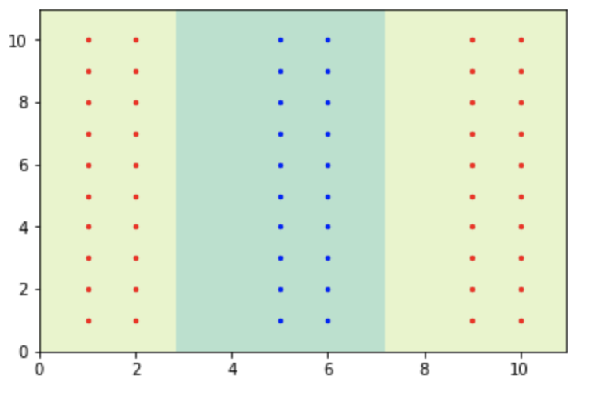

# Multiclass Classification Using kernel Perceptron and SVM 


## Multiclass Perceptron 
* <br /> <br />   
Red dots are labeled class 1;  
Green dots are labeled class 2;  
Blue dots are labeled class 3;  
Yellow dots are labeled class 4.

## Kernel Perceptron
* Data1<br /> <br />    
Data2 <br /> <br />  
* With $\sigma=1.0$:  
data1: <br /> <br /> 
data2: <br /> <br /> 
With $\sigma=10.0$:  
data1: <br /> <br /> 
data2: <br /> <br /> 

## Multiclass SVM
* ```
    C = 0.01
    Training accuracy: 0.831383333333
    Testing accuracy: 0.8249
    C = 0.1
    Training accuracy: 0.870466666667
    Testing accuracy: 0.8627
    C = 1.0
    Training accuracy: 0.848466666667
    Testing accuracy: 0.8452
    C = 10.0
    Training accuracy: 0.864416666667
    Testing accuracy: 0.8626
    C = 100.0
    Training accuracy: 0.889883333333
    Testing accuracy: 0.8758
    ```  
    It is not linearly separable.  
* ```
    Training accuracy: 1.0
    Testing accuracy: 0.9806
    Number of support vectors: [ 476  423  984  989  876 1060  641  882 1186 1135]
    ``` 