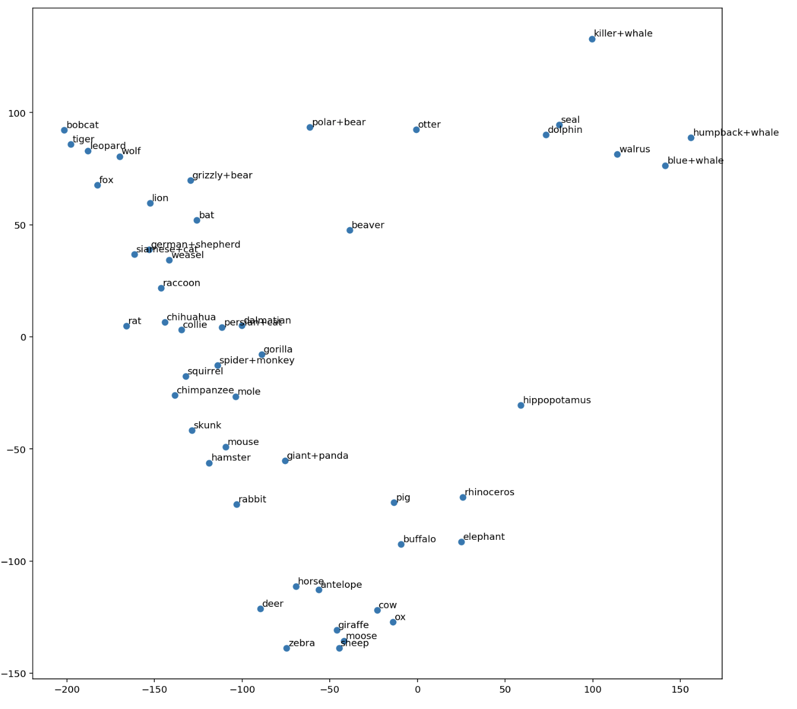

# Principal Component Analysis on animal attributes

*   
* From the labelled graph we can find some correlation on the grouping of these animal cliques. The animals in the top right corner are all aquatic animals. The animals in the top left corner are mostly ferocious carnivores. The animals in the bottom are mostly docile, herbivores. 